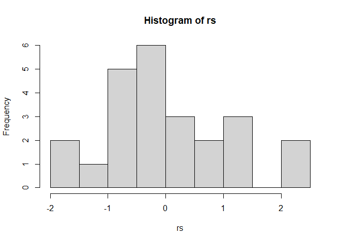
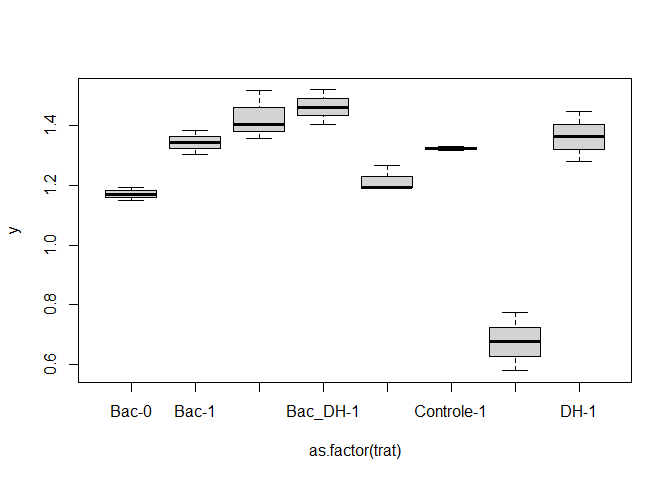

<!-- README.md is generated from README.Rmd. Please edit that file -->

# Análise Juan e Mayara - Enzimas, Estresse e Si.

## Carregando os pacotes necessários

``` r
library(ExpDes.pt)
library(tidyverse)
```

## Entrada de dados

``` r
library(readxl)
enzimas <- read_excel("data/enzimas.xlsx") %>% 
  mutate(Apx_log = log(Apx))
head(enzimas)
#> # A tibble: 6 x 14
#>   Cultivar Estresse    Si Trat         Rep   Gpx    Gr   Apx  Gpox   SOD Prolina
#>      <dbl> <chr>    <dbl> <chr>      <dbl> <dbl> <dbl> <dbl> <dbl> <dbl>   <dbl>
#> 1     3280 Controle     0 Controle-0     1  476.  2.22  70.5 0.268  29.7    4.70
#> 2     3280 Controle     0 Controle-0     2  476.  2.22  70.5 0.268  29.7    4.70
#> 3     3280 Controle     0 Controle-0     3  476.  2.22  70.5 0.268  29.7    4.70
#> 4     3280 DH           0 DH-0           1  787.  1.42 179.  0.426  26.2    3.60
#> 5     3280 DH           0 DH-0           2  743.  1.58 163.  0.306  26.3    4.11
#> 6     3280 DH           0 DH-0           3  698.  1.27 147.  0.432  22.5    3.09
#> # ... with 3 more variables: FvFm <dbl>, MDA <dbl>, Apx_log <dbl>
```

# Análise para Cultivar 3280

``` r
c3280 <- enzimas %>% 
  filter(Cultivar == 3280)
for(i in  6:length(c3280)){
  print("************ Análise de Variância ***************")
  print(paste0("Variável: ",names(c3280[,i])))
  print("*************************************************")
  
  print("--------Análise de resíduos---------")
  trat <- c3280 %>%  pull(Trat)
  y <- data.frame(c3280)[,i]
  mod <- aov(y~as.factor(trat))
  rs<-rstudent(mod)
  hist(rs)
  print(shapiro.test(rs))
  
  plot(y ~ as.factor(trat))
  print(lawstat::levene.test(y,trat))
  
  print("---------Teste F da ANOVA -----------")
  Estresse <- c3280$Estresse
  Si <- c3280$Si
  fat2.dic(Estresse,Si,y,
           fac.names = c("Estr","Si"))
  cat("\n")
}
#> [1] "************ Análise de Variância ***************"
#> [1] "Variável: Gpx"
#> [1] "*************************************************"
#> [1] "--------Análise de resíduos---------"
```

<!-- -->

    #> 
    #>  Shapiro-Wilk normality test
    #> 
    #> data:  rs
    #> W = 0.85548, p-value = 0.002767

<!-- -->

    #> 
    #>  Modified robust Brown-Forsythe Levene-type test based on the absolute
    #>  deviations from the median
    #> 
    #> data:  y
    #> Test Statistic = 1.8835, p-value = 0.1393
    #> 
    #> [1] "---------Teste F da ANOVA -----------"
    #> ------------------------------------------------------------------------
    #> Legenda:
    #> FATOR 1:  Estr 
    #> FATOR 2:  Si 
    #> ------------------------------------------------------------------------
    #> 
    #> 
    #> Quadro da analise de variancia
    #> ------------------------------------------------------------------------
    #>         GL      SQ QM     Fc      Pr>Fc
    #> Estr     3  397234  2 314.56 1.9780e-14
    #> Si       1  353853  4 840.63 2.9332e-15
    #> Estr*Si  3  412672  3 326.79 1.4657e-14
    #> Residuo 16    6735  5                  
    #> Total   23 1170495  1                  
    #> ------------------------------------------------------------------------
    #> CV = 8.26 %
    #> 
    #> ------------------------------------------------------------------------
    #> Teste de normalidade dos residuos (Shapiro-Wilk)
    #> valor-p:  0.02730561 
    #> ATENCAO: a 5% de significancia, os residuos nao podem ser considerados normais!
    #> ------------------------------------------------------------------------
    #> 
    #> 
    #> 
    #> Interacao significativa: desdobrando a interacao
    #> ------------------------------------------------------------------------
    #> 
    #> Desdobrando  Estr  dentro de cada nivel de  Si 
    #> ------------------------------------------------------------------------
    #> ------------------------------------------------------------------------
    #> Quadro da analise de variancia
    #> ------------------------------------------------------------------------
    #>           GL          SQ          QM       Fc  Pr.Fc
    #> Si         1  353853.277 353853.2773 840.6301      0
    #> Estr:Si 0  3  802642.180 267547.3934 635.5979      0
    #> Estr:Si 1  3    7264.191   2421.3969   5.7524 0.0072
    #> Residuo   16    6735.011    420.9382                
    #> Total     23 1170494.659  50891.0721                
    #> ------------------------------------------------------------------------
    #> 
    #> 
    #> 
    #>  Estr  dentro do nivel  0  de  Si 
    #> ------------------------------------------------------------------------
    #> Teste de Tukey
    #> ------------------------------------------------------------------------
    #> Grupos Tratamentos Medias
    #> a     DH      742.5114 
    #>  b    Controle    475.9689 
    #>   c   Bac_DH      167.8423 
    #>    d      Bac     93.07836 
    #> ------------------------------------------------------------------------
    #> 
    #> 
    #>  Estr  dentro do nivel  1  de  Si 
    #> ------------------------------------------------------------------------
    #> Teste de Tukey
    #> ------------------------------------------------------------------------
    #> Grupos Tratamentos Medias
    #> a     Bac     154.4554 
    #> a     Controle    145.1817 
    #> ab    DH      116.3479 
    #>  b    Bac_DH      92.02063 
    #> ------------------------------------------------------------------------
    #> 
    #> 
    #> 
    #> Desdobrando  Si  dentro de cada nivel de  Estr 
    #> ------------------------------------------------------------------------
    #> ------------------------------------------------------------------------
    #> Quadro da analise de variancia
    #> ------------------------------------------------------------------------
    #>                  GL          SQ          QM        Fc  Pr.Fc
    #> Estr              3  397234.258 132411.4194  314.5626      0
    #> Si:Estr Bac       1    5650.719   5650.7188   13.4241 0.0021
    #> Si:Estr Bac_DH    1    8623.390   8623.3904   20.4861  3e-04
    #> Si:Estr Controle  1  164130.241 164130.2408  389.9153      0
    #> Si:Estr DH        1  588121.040 588121.0399 1397.1673      0
    #> Residuo          16    6735.011    420.9382                 
    #> Total            23 1170494.659  50891.0721                 
    #> ------------------------------------------------------------------------
    #> 
    #> 
    #> 
    #>  Si  dentro do nivel  Bac  de  Estr 
    #> ------------------------------------------------------------------------
    #> Teste de Tukey
    #> ------------------------------------------------------------------------
    #> Grupos Tratamentos Medias
    #> a     1   154.4554 
    #>  b    0   93.07836 
    #> ------------------------------------------------------------------------
    #> 
    #> 
    #>  Si  dentro do nivel  Bac_DH  de  Estr 
    #> ------------------------------------------------------------------------
    #> Teste de Tukey
    #> ------------------------------------------------------------------------
    #> Grupos Tratamentos Medias
    #> a     0   167.8423 
    #>  b    1   92.02063 
    #> ------------------------------------------------------------------------
    #> 
    #> 
    #>  Si  dentro do nivel  Controle  de  Estr 
    #> ------------------------------------------------------------------------
    #> Teste de Tukey
    #> ------------------------------------------------------------------------
    #> Grupos Tratamentos Medias
    #> a     0   475.9689 
    #>  b    1   145.1817 
    #> ------------------------------------------------------------------------
    #> 
    #> 
    #>  Si  dentro do nivel  DH  de  Estr 
    #> ------------------------------------------------------------------------
    #> Teste de Tukey
    #> ------------------------------------------------------------------------
    #> Grupos Tratamentos Medias
    #> a     0   742.5114 
    #>  b    1   116.3479 
    #> ------------------------------------------------------------------------
    #> 
    #> [1] "************ Análise de Variância ***************"
    #> [1] "Variável: Gr"
    #> [1] "*************************************************"
    #> [1] "--------Análise de resíduos---------"

<!-- -->

    #> 
    #>  Shapiro-Wilk normality test
    #> 
    #> data:  rs
    #> W = 0.93996, p-value = 0.1628

<!-- -->

    #> 
    #>  Modified robust Brown-Forsythe Levene-type test based on the absolute
    #>  deviations from the median
    #> 
    #> data:  y
    #> Test Statistic = 0.78466, p-value = 0.6099
    #> 
    #> [1] "---------Teste F da ANOVA -----------"
    #> ------------------------------------------------------------------------
    #> Legenda:
    #> FATOR 1:  Estr 
    #> FATOR 2:  Si 
    #> ------------------------------------------------------------------------
    #> 
    #> 
    #> Quadro da analise de variancia
    #> ------------------------------------------------------------------------
    #>         GL      SQ QM      Fc   Pr>Fc
    #> Estr     3 0.04381  2  0.5967 0.62628
    #> Si       1 0.08075  4  3.2996 0.08808
    #> Estr*Si  3 2.25204  5 30.6748 0.00000
    #> Residuo 16 0.39156  3                
    #> Total   23 2.76815  1                
    #> ------------------------------------------------------------------------
    #> CV = 9.89 %
    #> 
    #> ------------------------------------------------------------------------
    #> Teste de normalidade dos residuos (Shapiro-Wilk)
    #> valor-p:  0.1748923 
    #> De acordo com o teste de Shapiro-Wilk a 5% de significancia, os residuos podem ser considerados normais.
    #> ------------------------------------------------------------------------
    #> 
    #> 
    #> 
    #> Interacao significativa: desdobrando a interacao
    #> ------------------------------------------------------------------------
    #> 
    #> Desdobrando  Estr  dentro de cada nivel de  Si 
    #> ------------------------------------------------------------------------
    #> ------------------------------------------------------------------------
    #> Quadro da analise de variancia
    #> ------------------------------------------------------------------------
    #>           GL      SQ      QM      Fc  Pr.Fc
    #> Si         1 0.08075 0.08075  3.2996 0.0881
    #> Estr:Si 0  3 1.40389 0.46796 19.1223      0
    #> Estr:Si 1  3 0.89196 0.29732 12.1493  2e-04
    #> Residuo   16 0.39156 0.02447               
    #> Total     23 2.76815 0.12035               
    #> ------------------------------------------------------------------------
    #> 
    #> 
    #> 
    #>  Estr  dentro do nivel  0  de  Si 
    #> ------------------------------------------------------------------------
    #> Teste de Tukey
    #> ------------------------------------------------------------------------
    #> Grupos Tratamentos Medias
    #> a     Controle    2.222584 
    #>  b    Bac_DH      1.542963 
    #>  b    DH      1.42347 
    #>  b    Bac     1.371191 
    #> ------------------------------------------------------------------------
    #> 
    #> 
    #>  Estr  dentro do nivel  1  de  Si 
    #> ------------------------------------------------------------------------
    #> Teste de Tukey
    #> ------------------------------------------------------------------------
    #> Grupos Tratamentos Medias
    #> a     Bac     1.79648 
    #> a     DH      1.630094 
    #> a     Bac_DH      1.599587 
    #>  b    Controle    1.070012 
    #> ------------------------------------------------------------------------
    #> 
    #> 
    #> 
    #> Desdobrando  Si  dentro de cada nivel de  Estr 
    #> ------------------------------------------------------------------------
    #> ------------------------------------------------------------------------
    #> Quadro da analise de variancia
    #> ------------------------------------------------------------------------
    #>                  GL      SQ      QM      Fc  Pr.Fc
    #> Estr              3 0.04381 0.01460  0.5967 0.6263
    #> Si:Estr Bac       1 0.27131 0.27131 11.0863 0.0042
    #> Si:Estr Bac_DH    1 0.00481 0.00481  0.1965 0.6635
    #> Si:Estr Controle  1 1.99263 1.99263 81.4243      0
    #> Si:Estr DH        1 0.06404 0.06404  2.6169 0.1253
    #> Residuo          16 0.39156 0.02447               
    #> Total            23 2.76815 0.12035               
    #> ------------------------------------------------------------------------
    #> 
    #> 
    #> 
    #>  Si  dentro do nivel  Bac  de  Estr 
    #> ------------------------------------------------------------------------
    #> Teste de Tukey
    #> ------------------------------------------------------------------------
    #> Grupos Tratamentos Medias
    #> a     1   1.79648 
    #>  b    0   1.371191 
    #> ------------------------------------------------------------------------
    #> 
    #> 
    #>  Si  dentro do nivel  Bac_DH  de  Estr 
    #> 
    #> De acordo com o teste F, as medias desse fator sao estatisticamente iguais.
    #> ------------------------------------------------------------------------
    #>   Niveis   Medias
    #> 1      0 1.542963
    #> 2      1 1.599587
    #> ------------------------------------------------------------------------
    #> 
    #> 
    #>  Si  dentro do nivel  Controle  de  Estr 
    #> ------------------------------------------------------------------------
    #> Teste de Tukey
    #> ------------------------------------------------------------------------
    #> Grupos Tratamentos Medias
    #> a     0   2.222584 
    #>  b    1   1.070012 
    #> ------------------------------------------------------------------------
    #> 
    #> 
    #>  Si  dentro do nivel  DH  de  Estr 
    #> 
    #> De acordo com o teste F, as medias desse fator sao estatisticamente iguais.
    #> ------------------------------------------------------------------------
    #>   Niveis   Medias
    #> 1      0 1.423470
    #> 2      1 1.630094
    #> ------------------------------------------------------------------------
    #> 
    #> [1] "************ Análise de Variância ***************"
    #> [1] "Variável: Apx"
    #> [1] "*************************************************"
    #> [1] "--------Análise de resíduos---------"

<!-- -->

    #> 
    #>  Shapiro-Wilk normality test
    #> 
    #> data:  rs
    #> W = 0.42304, p-value = 1.092e-08

<!-- -->

    #> 
    #>  Modified robust Brown-Forsythe Levene-type test based on the absolute
    #>  deviations from the median
    #> 
    #> data:  y
    #> Test Statistic = 3.8908, p-value = 0.01159
    #> 
    #> [1] "---------Teste F da ANOVA -----------"
    #> ------------------------------------------------------------------------
    #> Legenda:
    #> FATOR 1:  Estr 
    #> FATOR 2:  Si 
    #> ------------------------------------------------------------------------
    #> 
    #> 
    #> Quadro da analise de variancia
    #> ------------------------------------------------------------------------
    #>         GL         SQ QM     Fc      Pr>Fc
    #> Estr     3  533051688  4 142.27 9.5400e-12
    #> Si       1  204166269  5 163.48 8.1638e-10
    #> Estr*Si  3  527435672  3 140.78 1.0350e-11
    #> Residuo 16   19982145  2                  
    #> Total   23 1284635775  1                  
    #> ------------------------------------------------------------------------
    #> CV = 36.86 %
    #> 
    #> ------------------------------------------------------------------------
    #> Teste de normalidade dos residuos (Shapiro-Wilk)
    #> valor-p:  1.726993e-08 
    #> ATENCAO: a 5% de significancia, os residuos nao podem ser considerados normais!
    #> ------------------------------------------------------------------------
    #> 
    #> 
    #> 
    #> Interacao significativa: desdobrando a interacao
    #> ------------------------------------------------------------------------
    #> 
    #> Desdobrando  Estr  dentro de cada nivel de  Si 
    #> ------------------------------------------------------------------------
    #> ------------------------------------------------------------------------
    #> Quadro da analise de variancia
    #> ------------------------------------------------------------------------
    #>           GL           SQ           QM       Fc  Pr.Fc
    #> Si         1 2.041663e+08 2.041663e+08  163.479      0
    #> Estr:Si 0  3 2.580322e+04 8.601074e+03   0.0069 0.9992
    #> Estr:Si 1  3 1.060462e+09 3.534872e+08 283.0424      0
    #> Residuo   16 1.998215e+07 1.248884e+06                
    #> Total     23 1.284636e+09 5.585373e+07                
    #> ------------------------------------------------------------------------
    #> 
    #> 
    #> 
    #>  Estr  dentro do nivel  0  de  Si 
    #> 
    #> De acordo com o teste F, as medias desse fator sao estatisticamente iguais.
    #> ------------------------------------------------------------------------
    #>     Niveis    Medias
    #> 1      Bac  67.47635
    #> 2   Bac_DH 160.36183
    #> 3 Controle  70.48872
    #> 4       DH 163.00071
    #> ------------------------------------------------------------------------
    #> 
    #> 
    #>  Estr  dentro do nivel  1  de  Si 
    #> ------------------------------------------------------------------------
    #> Teste de Tukey
    #> ------------------------------------------------------------------------
    #> Grupos Tratamentos Medias
    #> a     Bac_DH      22219.8 
    #>  b    Controle    1055.566 
    #>  b    Bac     439.3797 
    #>  b    DH      79.88722 
    #> ------------------------------------------------------------------------
    #> 
    #> 
    #> 
    #> Desdobrando  Si  dentro de cada nivel de  Estr 
    #> ------------------------------------------------------------------------
    #> ------------------------------------------------------------------------
    #> Quadro da analise de variancia
    #> ------------------------------------------------------------------------
    #>                  GL           SQ           QM       Fc  Pr.Fc
    #> Estr              3 5.330517e+08 177683895.90 142.2741      0
    #> Si:Estr Bac       1 2.074682e+05    207468.15   0.1661  0.689
    #> Si:Estr Bac_DH    1 7.299285e+08 729928544.61 584.4646      0
    #> Si:Estr Controle  1 1.455567e+06   1455567.02   1.1655 0.2963
    #> Si:Estr DH        1 1.036178e+04     10361.78   0.0083 0.9286
    #> Residuo          16 1.998215e+07   1248884.09                
    #> Total            23 1.284636e+09  55853729.33                
    #> ------------------------------------------------------------------------
    #> 
    #> 
    #> 
    #>  Si  dentro do nivel  Bac  de  Estr 
    #> 
    #> De acordo com o teste F, as medias desse fator sao estatisticamente iguais.
    #> ------------------------------------------------------------------------
    #>   Niveis    Medias
    #> 1      0  67.47635
    #> 2      1 439.37970
    #> ------------------------------------------------------------------------
    #> 
    #> 
    #>  Si  dentro do nivel  Bac_DH  de  Estr 
    #> ------------------------------------------------------------------------
    #> Teste de Tukey
    #> ------------------------------------------------------------------------
    #> Grupos Tratamentos Medias
    #> a     1   22219.8 
    #>  b    0   160.3618 
    #> ------------------------------------------------------------------------
    #> 
    #> 
    #>  Si  dentro do nivel  Controle  de  Estr 
    #> 
    #> De acordo com o teste F, as medias desse fator sao estatisticamente iguais.
    #> ------------------------------------------------------------------------
    #>   Niveis     Medias
    #> 1      0   70.48872
    #> 2      1 1055.56639
    #> ------------------------------------------------------------------------
    #> 
    #> 
    #>  Si  dentro do nivel  DH  de  Estr 
    #> 
    #> De acordo com o teste F, as medias desse fator sao estatisticamente iguais.
    #> ------------------------------------------------------------------------
    #>   Niveis    Medias
    #> 1      0 163.00071
    #> 2      1  79.88722
    #> ------------------------------------------------------------------------
    #> 
    #> [1] "************ Análise de Variância ***************"
    #> [1] "Variável: Gpox"
    #> [1] "*************************************************"
    #> [1] "--------Análise de resíduos---------"

<!-- -->

    #> 
    #>  Shapiro-Wilk normality test
    #> 
    #> data:  rs
    #> W = 0.91705, p-value = 0.05028

<!-- -->

    #> 
    #>  Modified robust Brown-Forsythe Levene-type test based on the absolute
    #>  deviations from the median
    #> 
    #> data:  y
    #> Test Statistic = 0.97944, p-value = 0.4789
    #> 
    #> [1] "---------Teste F da ANOVA -----------"
    #> ------------------------------------------------------------------------
    #> Legenda:
    #> FATOR 1:  Estr 
    #> FATOR 2:  Si 
    #> ------------------------------------------------------------------------
    #> 
    #> 
    #> Quadro da analise de variancia
    #> ------------------------------------------------------------------------
    #>         GL      SQ QM      Fc      Pr>Fc
    #> Estr     3 0.06594  4  11.609 0.00027307
    #> Si       1 0.20574  5 108.666 0.00000002
    #> Estr*Si  3 0.04306  3   7.581 0.00224571
    #> Residuo 16 0.03029  2                   
    #> Total   23 0.34504  1                   
    #> ------------------------------------------------------------------------
    #> CV = 16.19 %
    #> 
    #> ------------------------------------------------------------------------
    #> Teste de normalidade dos residuos (Shapiro-Wilk)
    #> valor-p:  0.06104828 
    #> De acordo com o teste de Shapiro-Wilk a 5% de significancia, os residuos podem ser considerados normais.
    #> ------------------------------------------------------------------------
    #> 
    #> 
    #> 
    #> Interacao significativa: desdobrando a interacao
    #> ------------------------------------------------------------------------
    #> 
    #> Desdobrando  Estr  dentro de cada nivel de  Si 
    #> ------------------------------------------------------------------------
    #> ------------------------------------------------------------------------
    #> Quadro da analise de variancia
    #> ------------------------------------------------------------------------
    #>           GL      SQ      QM       Fc  Pr.Fc
    #> Si         1 0.20574 0.20574 108.6657      0
    #> Estr:Si 0  3 0.04063 0.01354   7.1532 0.0029
    #> Estr:Si 1  3 0.06837 0.02279  12.0375  2e-04
    #> Residuo   16 0.03029 0.00189                
    #> Total     23 0.34504 0.01500                
    #> ------------------------------------------------------------------------
    #> 
    #> 
    #> 
    #>  Estr  dentro do nivel  0  de  Si 
    #> ------------------------------------------------------------------------
    #> Teste de Tukey
    #> ------------------------------------------------------------------------
    #> Grupos Tratamentos Medias
    #> a     Bac     0.4255236 
    #> a     DH      0.3878136 
    #> ab    Bac_DH      0.3640136 
    #>  b    Controle    0.2679804 
    #> ------------------------------------------------------------------------
    #> 
    #> 
    #>  Estr  dentro do nivel  1  de  Si 
    #> ------------------------------------------------------------------------
    #> Teste de Tukey
    #> ------------------------------------------------------------------------
    #> Grupos Tratamentos Medias
    #> a     DH      0.274648 
    #> ab    Bac     0.1942721 
    #>  b    Controle    0.172459 
    #>   c   Bac_DH      0.06324579 
    #> ------------------------------------------------------------------------
    #> 
    #> 
    #> 
    #> Desdobrando  Si  dentro de cada nivel de  Estr 
    #> ------------------------------------------------------------------------
    #> ------------------------------------------------------------------------
    #> Quadro da analise de variancia
    #> ------------------------------------------------------------------------
    #>                  GL      SQ      QM      Fc  Pr.Fc
    #> Estr              3 0.06594 0.02198 11.6095  3e-04
    #> Si:Estr Bac       1 0.08022 0.08022 42.3671      0
    #> Si:Estr Bac_DH    1 0.13569 0.13569 71.6676      0
    #> Si:Estr Controle  1 0.01369 0.01369  7.2287 0.0161
    #> Si:Estr DH        1 0.01921 0.01921 10.1459 0.0058
    #> Residuo          16 0.03029 0.00189               
    #> Total            23 0.34504 0.01500               
    #> ------------------------------------------------------------------------
    #> 
    #> 
    #> 
    #>  Si  dentro do nivel  Bac  de  Estr 
    #> ------------------------------------------------------------------------
    #> Teste de Tukey
    #> ------------------------------------------------------------------------
    #> Grupos Tratamentos Medias
    #> a     0   0.4255236 
    #>  b    1   0.1942721 
    #> ------------------------------------------------------------------------
    #> 
    #> 
    #>  Si  dentro do nivel  Bac_DH  de  Estr 
    #> ------------------------------------------------------------------------
    #> Teste de Tukey
    #> ------------------------------------------------------------------------
    #> Grupos Tratamentos Medias
    #> a     0   0.3640136 
    #>  b    1   0.06324579 
    #> ------------------------------------------------------------------------
    #> 
    #> 
    #>  Si  dentro do nivel  Controle  de  Estr 
    #> ------------------------------------------------------------------------
    #> Teste de Tukey
    #> ------------------------------------------------------------------------
    #> Grupos Tratamentos Medias
    #> a     0   0.2679804 
    #>  b    1   0.172459 
    #> ------------------------------------------------------------------------
    #> 
    #> 
    #>  Si  dentro do nivel  DH  de  Estr 
    #> ------------------------------------------------------------------------
    #> Teste de Tukey
    #> ------------------------------------------------------------------------
    #> Grupos Tratamentos Medias
    #> a     0   0.3878136 
    #>  b    1   0.274648 
    #> ------------------------------------------------------------------------
    #> 
    #> [1] "************ Análise de Variância ***************"
    #> [1] "Variável: SOD"
    #> [1] "*************************************************"
    #> [1] "--------Análise de resíduos---------"

<!-- -->

    #> 
    #>  Shapiro-Wilk normality test
    #> 
    #> data:  rs
    #> W = 0.61175, p-value = 8.377e-07

<!-- -->

    #> 
    #>  Modified robust Brown-Forsythe Levene-type test based on the absolute
    #>  deviations from the median
    #> 
    #> data:  y
    #> Test Statistic = 2.6505, p-value = 0.05043
    #> 
    #> [1] "---------Teste F da ANOVA -----------"
    #> ------------------------------------------------------------------------
    #> Legenda:
    #> FATOR 1:  Estr 
    #> FATOR 2:  Si 
    #> ------------------------------------------------------------------------
    #> 
    #> 
    #> Quadro da analise de variancia
    #> ------------------------------------------------------------------------
    #>         GL     SQ QM     Fc   Pr>Fc
    #> Estr     3  86.62  5 1.4128 0.27561
    #> Si       1 133.42  2 6.5282 0.02119
    #> Estr*Si  3  51.76  3 0.8442 0.48959
    #> Residuo 16 327.00  4               
    #> Total   23 598.80  1               
    #> ------------------------------------------------------------------------
    #> CV = 17.01 %
    #> 
    #> ------------------------------------------------------------------------
    #> Teste de normalidade dos residuos (Shapiro-Wilk)
    #> valor-p:  2.921555e-05 
    #> ATENCAO: a 5% de significancia, os residuos nao podem ser considerados normais!
    #> ------------------------------------------------------------------------
    #> 
    #> Interacao nao significativa: analisando os efeitos simples
    #> ------------------------------------------------------------------------
    #> Estr
    #> De acordo com o teste F, as medias desse fator sao estatisticamente iguais.
    #> ------------------------------------------------------------------------
    #>     Niveis   Medias
    #> 1      Bac 26.27449
    #> 2   Bac_DH 29.61168
    #> 3 Controle 26.01169
    #> 4       DH 24.38230
    #> ------------------------------------------------------------------------
    #> Si
    #> Teste de Tukey
    #> ------------------------------------------------------------------------
    #> Grupos Tratamentos Medias
    #> a     0   28.92784 
    #>  b    1   24.21224 
    #> ------------------------------------------------------------------------
    #> 
    #> 
    #> [1] "************ Análise de Variância ***************"
    #> [1] "Variável: Prolina"
    #> [1] "*************************************************"
    #> [1] "--------Análise de resíduos---------"

<!-- -->

    #> 
    #>  Shapiro-Wilk normality test
    #> 
    #> data:  rs
    #> W = 0.92172, p-value = 0.06377

<!-- -->

    #> 
    #>  Modified robust Brown-Forsythe Levene-type test based on the absolute
    #>  deviations from the median
    #> 
    #> data:  y
    #> Test Statistic = 0.78147, p-value = 0.6122
    #> 
    #> [1] "---------Teste F da ANOVA -----------"
    #> ------------------------------------------------------------------------
    #> Legenda:
    #> FATOR 1:  Estr 
    #> FATOR 2:  Si 
    #> ------------------------------------------------------------------------
    #> 
    #> 
    #> Quadro da analise de variancia
    #> ------------------------------------------------------------------------
    #>         GL     SQ QM     Fc      Pr>Fc
    #> Estr     3 14.261  5 12.935 1.5159e-04
    #> Si       1 20.267  3 55.147 1.4370e-06
    #> Estr*Si  3 13.285  4 12.050 2.2348e-04
    #> Residuo 16  5.880  2                  
    #> Total   23 53.693  1                  
    #> ------------------------------------------------------------------------
    #> CV = 12.56 %
    #> 
    #> ------------------------------------------------------------------------
    #> Teste de normalidade dos residuos (Shapiro-Wilk)
    #> valor-p:  0.04726837 
    #> ATENCAO: a 5% de significancia, os residuos nao podem ser considerados normais!
    #> ------------------------------------------------------------------------
    #> 
    #> 
    #> 
    #> Interacao significativa: desdobrando a interacao
    #> ------------------------------------------------------------------------
    #> 
    #> Desdobrando  Estr  dentro de cada nivel de  Si 
    #> ------------------------------------------------------------------------
    #> ------------------------------------------------------------------------
    #> Quadro da analise de variancia
    #> ------------------------------------------------------------------------
    #>           GL       SQ       QM      Fc  Pr.Fc
    #> Si         1 20.26692 20.26692 55.1473      0
    #> Estr:Si 0  3  2.94400  0.98133  2.6703 0.0826
    #> Estr:Si 1  3 24.60217  8.20072 22.3146      0
    #> Residuo   16  5.88008  0.36751               
    #> Total     23 53.69317  2.33449               
    #> ------------------------------------------------------------------------
    #> 
    #> 
    #> 
    #>  Estr  dentro do nivel  0  de  Si 
    #> 
    #> De acordo com o teste F, as medias desse fator sao estatisticamente iguais.
    #> ------------------------------------------------------------------------
    #>     Niveis   Medias
    #> 1      Bac 3.928861
    #> 2   Bac_DH 3.404831
    #> 3 Controle 4.701931
    #> 4       DH 3.595923
    #> ------------------------------------------------------------------------
    #> 
    #> 
    #>  Estr  dentro do nivel  1  de  Si 
    #> ------------------------------------------------------------------------
    #> Teste de Tukey
    #> ------------------------------------------------------------------------
    #> Grupos Tratamentos Medias
    #> a     Bac_DH      7.08957 
    #> ab    Controle    6.813955 
    #>  b    DH      5.62262 
    #>   c   Bac     3.456941 
    #> ------------------------------------------------------------------------
    #> 
    #> 
    #> 
    #> Desdobrando  Si  dentro de cada nivel de  Estr 
    #> ------------------------------------------------------------------------
    #> ------------------------------------------------------------------------
    #> Quadro da analise de variancia
    #> ------------------------------------------------------------------------
    #>                  GL       SQ       QM      Fc  Pr.Fc
    #> Estr              3 14.26086  4.75362 12.9348  2e-04
    #> Si:Estr Bac       1  0.33406  0.33406   0.909 0.3546
    #> Si:Estr Bac_DH    1 20.36595 20.36595 55.4168      0
    #> Si:Estr Controle  1  6.69097  6.69097 18.2065  6e-04
    #> Si:Estr DH        1  6.16125  6.16125 16.7651  8e-04
    #> Residuo          16  5.88008  0.36751               
    #> Total            23 53.69317  2.33449               
    #> ------------------------------------------------------------------------
    #> 
    #> 
    #> 
    #>  Si  dentro do nivel  Bac  de  Estr 
    #> 
    #> De acordo com o teste F, as medias desse fator sao estatisticamente iguais.
    #> ------------------------------------------------------------------------
    #>   Niveis   Medias
    #> 1      0 3.928861
    #> 2      1 3.456941
    #> ------------------------------------------------------------------------
    #> 
    #> 
    #>  Si  dentro do nivel  Bac_DH  de  Estr 
    #> ------------------------------------------------------------------------
    #> Teste de Tukey
    #> ------------------------------------------------------------------------
    #> Grupos Tratamentos Medias
    #> a     1   7.08957 
    #>  b    0   3.404831 
    #> ------------------------------------------------------------------------
    #> 
    #> 
    #>  Si  dentro do nivel  Controle  de  Estr 
    #> ------------------------------------------------------------------------
    #> Teste de Tukey
    #> ------------------------------------------------------------------------
    #> Grupos Tratamentos Medias
    #> a     1   6.813955 
    #>  b    0   4.701931 
    #> ------------------------------------------------------------------------
    #> 
    #> 
    #>  Si  dentro do nivel  DH  de  Estr 
    #> ------------------------------------------------------------------------
    #> Teste de Tukey
    #> ------------------------------------------------------------------------
    #> Grupos Tratamentos Medias
    #> a     1   5.62262 
    #>  b    0   3.595923 
    #> ------------------------------------------------------------------------
    #> 
    #> [1] "************ Análise de Variância ***************"
    #> [1] "Variável: FvFm"
    #> [1] "*************************************************"
    #> [1] "--------Análise de resíduos---------"

<!-- -->

    #> 
    #>  Shapiro-Wilk normality test
    #> 
    #> data:  rs
    #> W = 0.93175, p-value = 0.1067

<!-- -->

    #> 
    #>  Modified robust Brown-Forsythe Levene-type test based on the absolute
    #>  deviations from the median
    #> 
    #> data:  y
    #> Test Statistic = 1.1946, p-value = 0.3599
    #> 
    #> [1] "---------Teste F da ANOVA -----------"
    #> ------------------------------------------------------------------------
    #> Legenda:
    #> FATOR 1:  Estr 
    #> FATOR 2:  Si 
    #> ------------------------------------------------------------------------
    #> 
    #> 
    #> Quadro da analise de variancia
    #> ------------------------------------------------------------------------
    #>         GL        SQ QM      Fc    Pr>Fc
    #> Estr     3 0.0004324  2  2.6902 0.081143
    #> Si       1 0.0002251  3  4.2016 0.057146
    #> Estr*Si  3 0.0017376  4 10.8115 0.000398
    #> Residuo 16 0.0008572  5                 
    #> Total   23 0.0032522  1                 
    #> ------------------------------------------------------------------------
    #> CV = 0.96 %
    #> 
    #> ------------------------------------------------------------------------
    #> Teste de normalidade dos residuos (Shapiro-Wilk)
    #> valor-p:  0.1304798 
    #> De acordo com o teste de Shapiro-Wilk a 5% de significancia, os residuos podem ser considerados normais.
    #> ------------------------------------------------------------------------
    #> 
    #> 
    #> 
    #> Interacao significativa: desdobrando a interacao
    #> ------------------------------------------------------------------------
    #> 
    #> Desdobrando  Estr  dentro de cada nivel de  Si 
    #> ------------------------------------------------------------------------
    #> ------------------------------------------------------------------------
    #> Quadro da analise de variancia
    #> ------------------------------------------------------------------------
    #>           GL      SQ      QM      Fc  Pr.Fc
    #> Si         1 0.00023 0.00023  4.2016 0.0571
    #> Estr:Si 0  3 0.00040 0.00013  2.4664 0.0996
    #> Estr:Si 1  3 0.00177 0.00059 11.0353  4e-04
    #> Residuo   16 0.00086 0.00005               
    #> Total     23 0.00325 0.00014               
    #> ------------------------------------------------------------------------
    #> 
    #> 
    #> 
    #>  Estr  dentro do nivel  0  de  Si 
    #> 
    #> De acordo com o teste F, as medias desse fator sao estatisticamente iguais.
    #> ------------------------------------------------------------------------
    #>     Niveis    Medias
    #> 1      Bac 0.7640000
    #> 2   Bac_DH 0.7573333
    #> 3 Controle 0.7723333
    #> 4       DH 0.7595000
    #> ------------------------------------------------------------------------
    #> 
    #> 
    #>  Estr  dentro do nivel  1  de  Si 
    #> ------------------------------------------------------------------------
    #> Teste de Tukey
    #> ------------------------------------------------------------------------
    #> Grupos Tratamentos Medias
    #> a     Bac_DH      0.7813333 
    #> a     Bac     0.7793333 
    #> ab    DH      0.766 
    #>  b    Controle    0.751 
    #> ------------------------------------------------------------------------
    #> 
    #> 
    #> 
    #> Desdobrando  Si  dentro de cada nivel de  Estr 
    #> ------------------------------------------------------------------------
    #> ------------------------------------------------------------------------
    #> Quadro da analise de variancia
    #> ------------------------------------------------------------------------
    #>                  GL      SQ      QM      Fc  Pr.Fc
    #> Estr              3 0.00043 0.00014  2.6902 0.0811
    #> Si:Estr Bac       1 0.00035 0.00035  6.5829 0.0207
    #> Si:Estr Bac_DH    1 0.00086 0.00086 16.1276  0.001
    #> Si:Estr Controle  1 0.00068 0.00068 12.7428 0.0026
    #> Si:Estr DH        1 0.00006 0.00006   1.183 0.2929
    #> Residuo          16 0.00086 0.00005               
    #> Total            23 0.00325 0.00014               
    #> ------------------------------------------------------------------------
    #> 
    #> 
    #> 
    #>  Si  dentro do nivel  Bac  de  Estr 
    #> ------------------------------------------------------------------------
    #> Teste de Tukey
    #> ------------------------------------------------------------------------
    #> Grupos Tratamentos Medias
    #> a     1   0.7793333 
    #>  b    0   0.764 
    #> ------------------------------------------------------------------------
    #> 
    #> 
    #>  Si  dentro do nivel  Bac_DH  de  Estr 
    #> ------------------------------------------------------------------------
    #> Teste de Tukey
    #> ------------------------------------------------------------------------
    #> Grupos Tratamentos Medias
    #> a     1   0.7813333 
    #>  b    0   0.7573333 
    #> ------------------------------------------------------------------------
    #> 
    #> 
    #>  Si  dentro do nivel  Controle  de  Estr 
    #> ------------------------------------------------------------------------
    #> Teste de Tukey
    #> ------------------------------------------------------------------------
    #> Grupos Tratamentos Medias
    #> a     0   0.7723333 
    #>  b    1   0.751 
    #> ------------------------------------------------------------------------
    #> 
    #> 
    #>  Si  dentro do nivel  DH  de  Estr 
    #> 
    #> De acordo com o teste F, as medias desse fator sao estatisticamente iguais.
    #> ------------------------------------------------------------------------
    #>   Niveis Medias
    #> 1      0 0.7595
    #> 2      1 0.7660
    #> ------------------------------------------------------------------------
    #> 
    #> [1] "************ Análise de Variância ***************"
    #> [1] "Variável: MDA"
    #> [1] "*************************************************"
    #> [1] "--------Análise de resíduos---------"

<!-- -->

    #> 
    #>  Shapiro-Wilk normality test
    #> 
    #> data:  rs
    #> W = 0.93433, p-value = 0.1219

<!-- -->

    #> 
    #>  Modified robust Brown-Forsythe Levene-type test based on the absolute
    #>  deviations from the median
    #> 
    #> data:  y
    #> Test Statistic = 1.2819, p-value = 0.3195
    #> 
    #> [1] "---------Teste F da ANOVA -----------"
    #> ------------------------------------------------------------------------
    #> Legenda:
    #> FATOR 1:  Estr 
    #> FATOR 2:  Si 
    #> ------------------------------------------------------------------------
    #> 
    #> 
    #> Quadro da analise de variancia
    #> ------------------------------------------------------------------------
    #>         GL      SQ QM      Fc     Pr>Fc
    #> Estr     3 0.31078  5 21.4409 0.0000075
    #> Si       1 0.05738  4 11.8759 0.0033205
    #> Estr*Si  3 0.11019  3  7.6021 0.0022179
    #> Residuo 16 0.07730  2                  
    #> Total   23 0.55565  1                  
    #> ------------------------------------------------------------------------
    #> CV = 7.27 %
    #> 
    #> ------------------------------------------------------------------------
    #> Teste de normalidade dos residuos (Shapiro-Wilk)
    #> valor-p:  0.1292854 
    #> De acordo com o teste de Shapiro-Wilk a 5% de significancia, os residuos podem ser considerados normais.
    #> ------------------------------------------------------------------------
    #> 
    #> 
    #> 
    #> Interacao significativa: desdobrando a interacao
    #> ------------------------------------------------------------------------
    #> 
    #> Desdobrando  Estr  dentro de cada nivel de  Si 
    #> ------------------------------------------------------------------------
    #> ------------------------------------------------------------------------
    #> Quadro da analise de variancia
    #> ------------------------------------------------------------------------
    #>           GL      SQ      QM      Fc  Pr.Fc
    #> Si         1 0.05738 0.05738 11.8759 0.0033
    #> Estr:Si 0  3 0.08787 0.02929  6.0624 0.0059
    #> Estr:Si 1  3 0.33310 0.11103 22.9807      0
    #> Residuo   16 0.07730 0.00483               
    #> Total     23 0.55565 0.02416               
    #> ------------------------------------------------------------------------
    #> 
    #> 
    #> 
    #>  Estr  dentro do nivel  0  de  Si 
    #> ------------------------------------------------------------------------
    #> Teste de Tukey
    #> ------------------------------------------------------------------------
    #> Grupos Tratamentos Medias
    #> a     Controle    1.0373 
    #> ab    DH      0.9132 
    #> ab    Bac     0.8751 
    #>  b    Bac_DH      0.8009 
    #> ------------------------------------------------------------------------
    #> 
    #> 
    #>  Estr  dentro do nivel  1  de  Si 
    #> ------------------------------------------------------------------------
    #> Teste de Tukey
    #> ------------------------------------------------------------------------
    #> Grupos Tratamentos Medias
    #> a     Controle    1.191933 
    #> a     Bac     1.1465 
    #>  b    Bac_DH      0.8657333 
    #>  b    DH      0.8135 
    #> ------------------------------------------------------------------------
    #> 
    #> 
    #> 
    #> Desdobrando  Si  dentro de cada nivel de  Estr 
    #> ------------------------------------------------------------------------
    #> ------------------------------------------------------------------------
    #> Quadro da analise de variancia
    #> ------------------------------------------------------------------------
    #>                  GL      SQ      QM      Fc  Pr.Fc
    #> Estr              3 0.31078 0.10359 21.4409      0
    #> Si:Estr Bac       1 0.11049 0.11049 22.8678  2e-04
    #> Si:Estr Bac_DH    1 0.00631 0.00631   1.305 0.2701
    #> Si:Estr Controle  1 0.03587 0.03587  7.4235  0.015
    #> Si:Estr DH        1 0.01491 0.01491   3.086 0.0981
    #> Residuo          16 0.07730 0.00483               
    #> Total            23 0.55565 0.02416               
    #> ------------------------------------------------------------------------
    #> 
    #> 
    #> 
    #>  Si  dentro do nivel  Bac  de  Estr 
    #> ------------------------------------------------------------------------
    #> Teste de Tukey
    #> ------------------------------------------------------------------------
    #> Grupos Tratamentos Medias
    #> a     1   1.1465 
    #>  b    0   0.8751 
    #> ------------------------------------------------------------------------
    #> 
    #> 
    #>  Si  dentro do nivel  Bac_DH  de  Estr 
    #> 
    #> De acordo com o teste F, as medias desse fator sao estatisticamente iguais.
    #> ------------------------------------------------------------------------
    #>   Niveis    Medias
    #> 1      0 0.8009000
    #> 2      1 0.8657333
    #> ------------------------------------------------------------------------
    #> 
    #> 
    #>  Si  dentro do nivel  Controle  de  Estr 
    #> ------------------------------------------------------------------------
    #> Teste de Tukey
    #> ------------------------------------------------------------------------
    #> Grupos Tratamentos Medias
    #> a     1   1.191933 
    #>  b    0   1.0373 
    #> ------------------------------------------------------------------------
    #> 
    #> 
    #>  Si  dentro do nivel  DH  de  Estr 
    #> 
    #> De acordo com o teste F, as medias desse fator sao estatisticamente iguais.
    #> ------------------------------------------------------------------------
    #>   Niveis Medias
    #> 1      0 0.9132
    #> 2      1 0.8135
    #> ------------------------------------------------------------------------
    #> 
    #> [1] "************ Análise de Variância ***************"
    #> [1] "Variável: Apx_log"
    #> [1] "*************************************************"
    #> [1] "--------Análise de resíduos---------"

<!-- -->

    #> 
    #>  Shapiro-Wilk normality test
    #> 
    #> data:  rs
    #> W = 0.93551, p-value = 0.1295

<!-- -->

    #> 
    #>  Modified robust Brown-Forsythe Levene-type test based on the absolute
    #>  deviations from the median
    #> 
    #> data:  y
    #> Test Statistic = 1.4078, p-value = 0.2687
    #> 
    #> [1] "---------Teste F da ANOVA -----------"
    #> ------------------------------------------------------------------------
    #> Legenda:
    #> FATOR 1:  Estr 
    #> FATOR 2:  Si 
    #> ------------------------------------------------------------------------
    #> 
    #> 
    #> Quadro da analise de variancia
    #> ------------------------------------------------------------------------
    #>         GL     SQ QM      Fc      Pr>Fc
    #> Estr     3 27.661  5  421.73 1.9641e-15
    #> Si       1 28.894  3 1321.57 8.2800e-17
    #> Estr*Si  3 24.509  4  373.66 5.1017e-15
    #> Residuo 16  0.350  2                   
    #> Total   23 81.414  1                   
    #> ------------------------------------------------------------------------
    #> CV = 2.57 %
    #> 
    #> ------------------------------------------------------------------------
    #> Teste de normalidade dos residuos (Shapiro-Wilk)
    #> valor-p:  0.4418265 
    #> De acordo com o teste de Shapiro-Wilk a 5% de significancia, os residuos podem ser considerados normais.
    #> ------------------------------------------------------------------------
    #> 
    #> 
    #> 
    #> Interacao significativa: desdobrando a interacao
    #> ------------------------------------------------------------------------
    #> 
    #> Desdobrando  Estr  dentro de cada nivel de  Si 
    #> ------------------------------------------------------------------------
    #> ------------------------------------------------------------------------
    #> Quadro da analise de variancia
    #> ------------------------------------------------------------------------
    #>           GL       SQ       QM        Fc Pr.Fc
    #> Si         1 28.89387 28.89387 1321.5684     0
    #> Estr:Si 0  3  2.14855  0.71618   32.7573     0
    #> Estr:Si 1  3 50.02144 16.67381  762.6387     0
    #> Residuo   16  0.34981  0.02186                
    #> Total     23 81.41367  3.53972                
    #> ------------------------------------------------------------------------
    #> 
    #> 
    #> 
    #>  Estr  dentro do nivel  0  de  Si 
    #> ------------------------------------------------------------------------
    #> Teste de Tukey
    #> ------------------------------------------------------------------------
    #> Grupos Tratamentos Medias
    #> a     DH      5.090699 
    #> a     Bac_DH      5.064626 
    #>  b    Controle    4.255453 
    #>  b    Bac     4.208998 
    #> ------------------------------------------------------------------------
    #> 
    #> 
    #>  Estr  dentro do nivel  1  de  Si 
    #> ------------------------------------------------------------------------
    #> Teste de Tukey
    #> ------------------------------------------------------------------------
    #> Grupos Tratamentos Medias
    #> a     Bac_DH      10.00195 
    #>  b    Controle    6.957884 
    #>   c   Bac     6.057451 
    #>    d      DH      4.380327 
    #> ------------------------------------------------------------------------
    #> 
    #> 
    #> 
    #> Desdobrando  Si  dentro de cada nivel de  Estr 
    #> ------------------------------------------------------------------------
    #> ------------------------------------------------------------------------
    #> Quadro da analise de variancia
    #> ------------------------------------------------------------------------
    #>                  GL       SQ       QM        Fc Pr.Fc
    #> Estr              3 27.66137  9.22046  421.7318     0
    #> Si:Estr Bac       1  5.12517  5.12517  234.4185     0
    #> Si:Estr Bac_DH    1 36.56568 36.56568 1672.4667     0
    #> Si:Estr Controle  1 10.95470 10.95470   501.054     0
    #> Si:Estr DH        1  0.75694  0.75694   34.6215     0
    #> Residuo          16  0.34981  0.02186                
    #> Total            23 81.41367  3.53972                
    #> ------------------------------------------------------------------------
    #> 
    #> 
    #> 
    #>  Si  dentro do nivel  Bac  de  Estr 
    #> ------------------------------------------------------------------------
    #> Teste de Tukey
    #> ------------------------------------------------------------------------
    #> Grupos Tratamentos Medias
    #> a     1   6.057451 
    #>  b    0   4.208998 
    #> ------------------------------------------------------------------------
    #> 
    #> 
    #>  Si  dentro do nivel  Bac_DH  de  Estr 
    #> ------------------------------------------------------------------------
    #> Teste de Tukey
    #> ------------------------------------------------------------------------
    #> Grupos Tratamentos Medias
    #> a     1   10.00195 
    #>  b    0   5.064626 
    #> ------------------------------------------------------------------------
    #> 
    #> 
    #>  Si  dentro do nivel  Controle  de  Estr 
    #> ------------------------------------------------------------------------
    #> Teste de Tukey
    #> ------------------------------------------------------------------------
    #> Grupos Tratamentos Medias
    #> a     1   6.957884 
    #>  b    0   4.255453 
    #> ------------------------------------------------------------------------
    #> 
    #> 
    #>  Si  dentro do nivel  DH  de  Estr 
    #> ------------------------------------------------------------------------
    #> Teste de Tukey
    #> ------------------------------------------------------------------------
    #> Grupos Tratamentos Medias
    #> a     0   5.090699 
    #>  b    1   4.380327 
    #> ------------------------------------------------------------------------

# Análise para Cultivar 4467

``` r
c4467 <- enzimas %>% 
  filter(Cultivar == 4467)
for(i in  6:length(c3280)){
  print("************ Análise de Variância ***************")
  print(paste0("Variável: ",names(c4467[,i])))
  print("*************************************************")
  
  print("--------Análise de resíduos---------")
  trat <- c4467 %>%  pull(Trat)
  y <- data.frame(c4467)[,i]
  mod <- aov(y~as.factor(trat))
  rs<-rstudent(mod)
  hist(rs)
  print(shapiro.test(rs))
  
  plot(y ~ as.factor(trat))
  print(lawstat::levene.test(y,trat))
  
  print("---------Teste F da ANOVA -----------")
  Estresse <- c4467$Estresse
  Si <- c4467$Si
  fat2.dic(Estresse,Si,y,
           fac.names = c("Estr","Si"))
  cat("\n")
}
#> [1] "************ Análise de Variância ***************"
#> [1] "Variável: Gpx"
#> [1] "*************************************************"
#> [1] "--------Análise de resíduos---------"
```

<!-- -->

    #> 
    #>  Shapiro-Wilk normality test
    #> 
    #> data:  rs
    #> W = 0.96746, p-value = 0.6048

<!-- -->

    #> 
    #>  Modified robust Brown-Forsythe Levene-type test based on the absolute
    #>  deviations from the median
    #> 
    #> data:  y
    #> Test Statistic = 0.80876, p-value = 0.5926
    #> 
    #> [1] "---------Teste F da ANOVA -----------"
    #> ------------------------------------------------------------------------
    #> Legenda:
    #> FATOR 1:  Estr 
    #> FATOR 2:  Si 
    #> ------------------------------------------------------------------------
    #> 
    #> 
    #> Quadro da analise de variancia
    #> ------------------------------------------------------------------------
    #>         GL     SQ QM     Fc      Pr>Fc
    #> Estr     3 196282  5 642.37 7.0000e-17
    #> Si       1  36078  3 354.22 2.4373e-12
    #> Estr*Si  3 176691  4 578.25 1.6000e-16
    #> Residuo 16   1630  2                  
    #> Total   23 410681  1                  
    #> ------------------------------------------------------------------------
    #> CV = 5.83 %
    #> 
    #> ------------------------------------------------------------------------
    #> Teste de normalidade dos residuos (Shapiro-Wilk)
    #> valor-p:  0.5716933 
    #> De acordo com o teste de Shapiro-Wilk a 5% de significancia, os residuos podem ser considerados normais.
    #> ------------------------------------------------------------------------
    #> 
    #> 
    #> 
    #> Interacao significativa: desdobrando a interacao
    #> ------------------------------------------------------------------------
    #> 
    #> Desdobrando  Estr  dentro de cada nivel de  Si 
    #> ------------------------------------------------------------------------
    #> ------------------------------------------------------------------------
    #> Quadro da analise de variancia
    #> ------------------------------------------------------------------------
    #>           GL         SQ          QM        Fc Pr.Fc
    #> Si         1  36078.289  36078.2887  354.2181     0
    #> Estr:Si 0  3 369215.818 123071.9392 1208.3254     0
    #> Estr:Si 1  3   3757.423   1252.4743   12.2968 2e-04
    #> Residuo   16   1629.653    101.8533                
    #> Total     23 410681.182  17855.7036                
    #> ------------------------------------------------------------------------
    #> 
    #> 
    #> 
    #>  Estr  dentro do nivel  0  de  Si 
    #> ------------------------------------------------------------------------
    #> Teste de Tukey
    #> ------------------------------------------------------------------------
    #> Grupos Tratamentos Medias
    #> a     DH      510.8732 
    #>  b    Controle    163.416 
    #>   c   Bac     87.78981 
    #>   c   Bac_DH      85.67436 
    #> ------------------------------------------------------------------------
    #> 
    #> 
    #>  Estr  dentro do nivel  1  de  Si 
    #> ------------------------------------------------------------------------
    #> Teste de Tukey
    #> ------------------------------------------------------------------------
    #> Grupos Tratamentos Medias
    #> a     Controle    158.6563 
    #> ab    DH      137.7642 
    #>  bc   Bac_DH      132.2136 
    #>   c   Bac     108.944 
    #> ------------------------------------------------------------------------
    #> 
    #> 
    #> 
    #> Desdobrando  Si  dentro de cada nivel de  Estr 
    #> ------------------------------------------------------------------------
    #> ------------------------------------------------------------------------
    #> Quadro da analise de variancia
    #> ------------------------------------------------------------------------
    #>                  GL           SQ           QM        Fc  Pr.Fc
    #> Estr              3 196281.91320  65427.30440   642.368      0
    #> Si:Estr Bac       1    671.24669    671.24669    6.5903 0.0207
    #> Si:Estr Bac_DH    1   3248.84699   3248.84699   31.8973      0
    #> Si:Estr Controle  1     33.98201     33.98201    0.3336 0.5716
    #> Si:Estr DH        1 208815.54033 208815.54033 2050.1597      0
    #> Residuo          16   1629.65289    101.85331                 
    #> Total            23 410681.18212  17855.70357                 
    #> ------------------------------------------------------------------------
    #> 
    #> 
    #> 
    #>  Si  dentro do nivel  Bac  de  Estr 
    #> ------------------------------------------------------------------------
    #> Teste de Tukey
    #> ------------------------------------------------------------------------
    #> Grupos Tratamentos Medias
    #> a     1   108.944 
    #>  b    0   87.78981 
    #> ------------------------------------------------------------------------
    #> 
    #> 
    #>  Si  dentro do nivel  Bac_DH  de  Estr 
    #> ------------------------------------------------------------------------
    #> Teste de Tukey
    #> ------------------------------------------------------------------------
    #> Grupos Tratamentos Medias
    #> a     1   132.2136 
    #>  b    0   85.67436 
    #> ------------------------------------------------------------------------
    #> 
    #> 
    #>  Si  dentro do nivel  Controle  de  Estr 
    #> 
    #> De acordo com o teste F, as medias desse fator sao estatisticamente iguais.
    #> ------------------------------------------------------------------------
    #>   Niveis   Medias
    #> 1      0 163.4160
    #> 2      1 158.6563
    #> ------------------------------------------------------------------------
    #> 
    #> 
    #>  Si  dentro do nivel  DH  de  Estr 
    #> ------------------------------------------------------------------------
    #> Teste de Tukey
    #> ------------------------------------------------------------------------
    #> Grupos Tratamentos Medias
    #> a     0   510.8732 
    #>  b    1   137.7642 
    #> ------------------------------------------------------------------------
    #> 
    #> [1] "************ Análise de Variância ***************"
    #> [1] "Variável: Gr"
    #> [1] "*************************************************"
    #> [1] "--------Análise de resíduos---------"

<!-- -->

    #> 
    #>  Shapiro-Wilk normality test
    #> 
    #> data:  rs
    #> W = 0.94007, p-value = 0.1637

<!-- -->

    #> 
    #>  Modified robust Brown-Forsythe Levene-type test based on the absolute
    #>  deviations from the median
    #> 
    #> data:  y
    #> Test Statistic = 1.3748, p-value = 0.2812
    #> 
    #> [1] "---------Teste F da ANOVA -----------"
    #> ------------------------------------------------------------------------
    #> Legenda:
    #> FATOR 1:  Estr 
    #> FATOR 2:  Si 
    #> ------------------------------------------------------------------------
    #> 
    #> 
    #> Quadro da analise de variancia
    #> ------------------------------------------------------------------------
    #>         GL      SQ QM     Fc      Pr>Fc
    #> Estr     3 0.59842  4 25.822 2.2670e-06
    #> Si       1 0.27479  5 35.571 1.9821e-05
    #> Estr*Si  3 0.32881  3 14.188 9.0147e-05
    #> Residuo 16 0.12360  2                  
    #> Total   23 1.32563  1                  
    #> ------------------------------------------------------------------------
    #> CV = 7.15 %
    #> 
    #> ------------------------------------------------------------------------
    #> Teste de normalidade dos residuos (Shapiro-Wilk)
    #> valor-p:  0.344202 
    #> De acordo com o teste de Shapiro-Wilk a 5% de significancia, os residuos podem ser considerados normais.
    #> ------------------------------------------------------------------------
    #> 
    #> 
    #> 
    #> Interacao significativa: desdobrando a interacao
    #> ------------------------------------------------------------------------
    #> 
    #> Desdobrando  Estr  dentro de cada nivel de  Si 
    #> ------------------------------------------------------------------------
    #> ------------------------------------------------------------------------
    #> Quadro da analise de variancia
    #> ------------------------------------------------------------------------
    #>           GL      SQ      QM      Fc  Pr.Fc
    #> Si         1 0.27479 0.27479 35.5714      0
    #> Estr:Si 0  3 0.90299 0.30100 38.9638      0
    #> Estr:Si 1  3 0.02425 0.00808  1.0462 0.3991
    #> Residuo   16 0.12360 0.00773               
    #> Total     23 1.32563 0.05764               
    #> ------------------------------------------------------------------------
    #> 
    #> 
    #> 
    #>  Estr  dentro do nivel  0  de  Si 
    #> ------------------------------------------------------------------------
    #> Teste de Tukey
    #> ------------------------------------------------------------------------
    #> Grupos Tratamentos Medias
    #> a     Bac_DH      1.424292 
    #>  b    Controle    1.216845 
    #>  b    Bac     1.169545 
    #>   c   DH      0.6766224 
    #> ------------------------------------------------------------------------
    #> 
    #> 
    #>  Estr  dentro do nivel  1  de  Si 
    #> 
    #> De acordo com o teste F, as medias desse fator sao estatisticamente iguais.
    #> ------------------------------------------------------------------------
    #>     Niveis   Medias
    #> 1      Bac 1.341589
    #> 2   Bac_DH 1.402694
    #> 3 Controle 1.321221
    #> 4       DH 1.277824
    #> ------------------------------------------------------------------------
    #> 
    #> 
    #> 
    #> Desdobrando  Si  dentro de cada nivel de  Estr 
    #> ------------------------------------------------------------------------
    #> ------------------------------------------------------------------------
    #> Quadro da analise de variancia
    #> ------------------------------------------------------------------------
    #>                  GL      SQ      QM      Fc  Pr.Fc
    #> Estr              3 0.59842 0.19947 25.8218      0
    #> Si:Estr Bac       1 0.04440 0.04440  5.7473 0.0291
    #> Si:Estr Bac_DH    1 0.00070 0.00070  0.0906 0.7673
    #> Si:Estr Controle  1 0.01634 0.01634  2.1154 0.1652
    #> Si:Estr DH        1 0.54217 0.54217 70.1826      0
    #> Residuo          16 0.12360 0.00773               
    #> Total            23 1.32563 0.05764               
    #> ------------------------------------------------------------------------
    #> 
    #> 
    #> 
    #>  Si  dentro do nivel  Bac  de  Estr 
    #> ------------------------------------------------------------------------
    #> Teste de Tukey
    #> ------------------------------------------------------------------------
    #> Grupos Tratamentos Medias
    #> a     1   1.341589 
    #>  b    0   1.169545 
    #> ------------------------------------------------------------------------
    #> 
    #> 
    #>  Si  dentro do nivel  Bac_DH  de  Estr 
    #> 
    #> De acordo com o teste F, as medias desse fator sao estatisticamente iguais.
    #> ------------------------------------------------------------------------
    #>   Niveis   Medias
    #> 1      0 1.424292
    #> 2      1 1.402694
    #> ------------------------------------------------------------------------
    #> 
    #> 
    #>  Si  dentro do nivel  Controle  de  Estr 
    #> 
    #> De acordo com o teste F, as medias desse fator sao estatisticamente iguais.
    #> ------------------------------------------------------------------------
    #>   Niveis   Medias
    #> 1      0 1.216845
    #> 2      1 1.321221
    #> ------------------------------------------------------------------------
    #> 
    #> 
    #>  Si  dentro do nivel  DH  de  Estr 
    #> ------------------------------------------------------------------------
    #> Teste de Tukey
    #> ------------------------------------------------------------------------
    #> Grupos Tratamentos Medias
    #> a     1   1.277824 
    #>  b    0   0.6766224 
    #> ------------------------------------------------------------------------
    #> 
    #> [1] "************ Análise de Variância ***************"
    #> [1] "Variável: Apx"
    #> [1] "*************************************************"
    #> [1] "--------Análise de resíduos---------"

<!-- -->

    #> 
    #>  Shapiro-Wilk normality test
    #> 
    #> data:  rs
    #> W = 0.42347, p-value = 1.102e-08

<!-- -->

    #> 
    #>  Modified robust Brown-Forsythe Levene-type test based on the absolute
    #>  deviations from the median
    #> 
    #> data:  y
    #> Test Statistic = 3.8936, p-value = 0.01155
    #> 
    #> [1] "---------Teste F da ANOVA -----------"
    #> ------------------------------------------------------------------------
    #> Legenda:
    #> FATOR 1:  Estr 
    #> FATOR 2:  Si 
    #> ------------------------------------------------------------------------
    #> 
    #> 
    #> Quadro da analise de variancia
    #> ------------------------------------------------------------------------
    #>         GL        SQ QM     Fc      Pr>Fc
    #> Estr     3  67194802  2 45.827 4.4350e-08
    #> Si       1  26201912  4 53.609 1.7158e-06
    #> Estr*Si  3  68073189  3 46.426 4.0430e-08
    #> Residuo 16   7820086  5                  
    #> Total   23 169289989  1                  
    #> ------------------------------------------------------------------------
    #> CV = 61.69 %
    #> 
    #> ------------------------------------------------------------------------
    #> Teste de normalidade dos residuos (Shapiro-Wilk)
    #> valor-p:  1.74957e-08 
    #> ATENCAO: a 5% de significancia, os residuos nao podem ser considerados normais!
    #> ------------------------------------------------------------------------
    #> 
    #> 
    #> 
    #> Interacao significativa: desdobrando a interacao
    #> ------------------------------------------------------------------------
    #> 
    #> Desdobrando  Estr  dentro de cada nivel de  Si 
    #> ------------------------------------------------------------------------
    #> ------------------------------------------------------------------------
    #> Quadro da analise de variancia
    #> ------------------------------------------------------------------------
    #>           GL           SQ           QM      Fc  Pr.Fc
    #> Si         1 2.620191e+07 26201911.874 53.6095      0
    #> Estr:Si 0  3 3.189979e+03     1063.326  0.0022 0.9999
    #> Estr:Si 1  3 1.352648e+08 45088267.079 92.2512      0
    #> Residuo   16 7.820086e+06   488755.359               
    #> Total     23 1.692900e+08  7360434.297               
    #> ------------------------------------------------------------------------
    #> 
    #> 
    #> 
    #>  Estr  dentro do nivel  0  de  Si 
    #> 
    #> De acordo com o teste F, as medias desse fator sao estatisticamente iguais.
    #> ------------------------------------------------------------------------
    #>     Niveis    Medias
    #> 1      Bac 103.38346
    #> 2   Bac_DH 105.73308
    #> 3 Controle  74.01314
    #> 4       DH  70.19495
    #> ------------------------------------------------------------------------
    #> 
    #> 
    #>  Estr  dentro do nivel  1  de  Si 
    #> ------------------------------------------------------------------------
    #> Teste de Tukey
    #> ------------------------------------------------------------------------
    #> Grupos Tratamentos Medias
    #> a     DH      7988.722 
    #>  b    Controle    439.5797 
    #>  b    Bac_DH      215.8173 
    #>  b    Bac     68.1391 
    #> ------------------------------------------------------------------------
    #> 
    #> 
    #> 
    #> Desdobrando  Si  dentro de cada nivel de  Estr 
    #> ------------------------------------------------------------------------
    #> ------------------------------------------------------------------------
    #> Quadro da analise de variancia
    #> ------------------------------------------------------------------------
    #>                  GL           SQ           QM      Fc  Pr.Fc
    #> Estr              3 6.719480e+07 22398267.463 45.8272      0
    #> Si:Estr Bac       1 1.863247e+03     1863.247  0.0038 0.9515
    #> Si:Estr Bac_DH    1 1.817780e+04    18177.804  0.0372 0.8495
    #> Si:Estr Controle  1 2.004583e+05   200458.329  0.4101  0.531
    #> Si:Estr DH        1 9.405460e+07 94054601.321 192.437      0
    #> Residuo          16 7.820086e+06   488755.359               
    #> Total            23 1.692900e+08  7360434.297               
    #> ------------------------------------------------------------------------
    #> 
    #> 
    #> 
    #>  Si  dentro do nivel  Bac  de  Estr 
    #> 
    #> De acordo com o teste F, as medias desse fator sao estatisticamente iguais.
    #> ------------------------------------------------------------------------
    #>   Niveis   Medias
    #> 1      0 103.3835
    #> 2      1  68.1391
    #> ------------------------------------------------------------------------
    #> 
    #> 
    #>  Si  dentro do nivel  Bac_DH  de  Estr 
    #> 
    #> De acordo com o teste F, as medias desse fator sao estatisticamente iguais.
    #> ------------------------------------------------------------------------
    #>   Niveis   Medias
    #> 1      0 105.7331
    #> 2      1 215.8173
    #> ------------------------------------------------------------------------
    #> 
    #> 
    #>  Si  dentro do nivel  Controle  de  Estr 
    #> 
    #> De acordo com o teste F, as medias desse fator sao estatisticamente iguais.
    #> ------------------------------------------------------------------------
    #>   Niveis    Medias
    #> 1      0  74.01314
    #> 2      1 439.57967
    #> ------------------------------------------------------------------------
    #> 
    #> 
    #>  Si  dentro do nivel  DH  de  Estr 
    #> ------------------------------------------------------------------------
    #> Teste de Tukey
    #> ------------------------------------------------------------------------
    #> Grupos Tratamentos Medias
    #> a     1   7988.722 
    #>  b    0   70.19495 
    #> ------------------------------------------------------------------------
    #> 
    #> [1] "************ Análise de Variância ***************"
    #> [1] "Variável: Gpox"
    #> [1] "*************************************************"
    #> [1] "--------Análise de resíduos---------"

<!-- -->

    #> 
    #>  Shapiro-Wilk normality test
    #> 
    #> data:  rs
    #> W = 0.95477, p-value = 0.3425

<!-- -->

    #> 
    #>  Modified robust Brown-Forsythe Levene-type test based on the absolute
    #>  deviations from the median
    #> 
    #> data:  y
    #> Test Statistic = 0.88978, p-value = 0.5367
    #> 
    #> [1] "---------Teste F da ANOVA -----------"
    #> ------------------------------------------------------------------------
    #> Legenda:
    #> FATOR 1:  Estr 
    #> FATOR 2:  Si 
    #> ------------------------------------------------------------------------
    #> 
    #> 
    #> Quadro da analise de variancia
    #> ------------------------------------------------------------------------
    #>         GL       SQ QM     Fc    Pr>Fc
    #> Estr     3 0.036675  4  5.681 0.007609
    #> Si       1 0.148923  5 69.203 0.000000
    #> Estr*Si  3 0.015194  3  2.354 0.110585
    #> Residuo 16 0.034432  2                
    #> Total   23 0.235225  1                
    #> ------------------------------------------------------------------------
    #> CV = 17.84 %
    #> 
    #> ------------------------------------------------------------------------
    #> Teste de normalidade dos residuos (Shapiro-Wilk)
    #> valor-p:  0.6399844 
    #> De acordo com o teste de Shapiro-Wilk a 5% de significancia, os residuos podem ser considerados normais.
    #> ------------------------------------------------------------------------
    #> 
    #> Interacao nao significativa: analisando os efeitos simples
    #> ------------------------------------------------------------------------
    #> Estr
    #> Teste de Tukey
    #> ------------------------------------------------------------------------
    #> Grupos Tratamentos Medias
    #> a     Bac     0.3117057 
    #> ab    Controle    0.2649833 
    #> ab    DH      0.2619971 
    #>  b    Bac_DH      0.2016028 
    #> ------------------------------------------------------------------------
    #> 
    #> Si
    #> Teste de Tukey
    #> ------------------------------------------------------------------------
    #> Grupos Tratamentos Medias
    #> a     0   0.338845 
    #>  b    1   0.1812995 
    #> ------------------------------------------------------------------------
    #> 
    #> 
    #> [1] "************ Análise de Variância ***************"
    #> [1] "Variável: SOD"
    #> [1] "*************************************************"
    #> [1] "--------Análise de resíduos---------"

<!-- -->

    #> 
    #>  Shapiro-Wilk normality test
    #> 
    #> data:  rs
    #> W = 0.93868, p-value = 0.1524

<!-- -->

    #> 
    #>  Modified robust Brown-Forsythe Levene-type test based on the absolute
    #>  deviations from the median
    #> 
    #> data:  y
    #> Test Statistic = 0.33472, p-value = 0.9263
    #> 
    #> [1] "---------Teste F da ANOVA -----------"
    #> ------------------------------------------------------------------------
    #> Legenda:
    #> FATOR 1:  Estr 
    #> FATOR 2:  Si 
    #> ------------------------------------------------------------------------
    #> 
    #> 
    #> Quadro da analise de variancia
    #> ------------------------------------------------------------------------
    #>         GL     SQ QM      Fc   Pr>Fc
    #> Estr     3 16.255  5 2.33112 0.11292
    #> Si       1  0.669  2 0.28773 0.59906
    #> Estr*Si  3  9.750  4 1.39824 0.27966
    #> Residuo 16 37.190  3                
    #> Total   23 63.864  1                
    #> ------------------------------------------------------------------------
    #> CV = 6.47 %
    #> 
    #> ------------------------------------------------------------------------
    #> Teste de normalidade dos residuos (Shapiro-Wilk)
    #> valor-p:  0.1915559 
    #> De acordo com o teste de Shapiro-Wilk a 5% de significancia, os residuos podem ser considerados normais.
    #> ------------------------------------------------------------------------
    #> 
    #> Interacao nao significativa: analisando os efeitos simples
    #> ------------------------------------------------------------------------
    #> Estr
    #> De acordo com o teste F, as medias desse fator sao estatisticamente iguais.
    #> ------------------------------------------------------------------------
    #>     Niveis   Medias
    #> 1      Bac 22.78493
    #> 2   Bac_DH 24.95212
    #> 3 Controle 23.17367
    #> 4       DH 23.40898
    #> ------------------------------------------------------------------------
    #> Si
    #> De acordo com o teste F, as medias desse fator sao estatisticamente iguais.
    #> ------------------------------------------------------------------------
    #>   Niveis   Medias
    #> 1      0 23.41300
    #> 2      1 23.74686
    #> ------------------------------------------------------------------------
    #> 
    #> [1] "************ Análise de Variância ***************"
    #> [1] "Variável: Prolina"
    #> [1] "*************************************************"
    #> [1] "--------Análise de resíduos---------"

<!-- -->

    #> 
    #>  Shapiro-Wilk normality test
    #> 
    #> data:  rs
    #> W = 0.96098, p-value = 0.4584

<!-- -->

    #> 
    #>  Modified robust Brown-Forsythe Levene-type test based on the absolute
    #>  deviations from the median
    #> 
    #> data:  y
    #> Test Statistic = 0.6532, p-value = 0.7073
    #> 
    #> [1] "---------Teste F da ANOVA -----------"
    #> ------------------------------------------------------------------------
    #> Legenda:
    #> FATOR 1:  Estr 
    #> FATOR 2:  Si 
    #> ------------------------------------------------------------------------
    #> 
    #> 
    #> Quadro da analise de variancia
    #> ------------------------------------------------------------------------
    #>         GL      SQ QM      Fc     Pr>Fc
    #> Estr     3  84.131  3 22.7563 0.0000051
    #> Si       1  30.314  4 24.5986 0.0001420
    #> Estr*Si  3  14.394  5  3.8935 0.0289614
    #> Residuo 16  19.718  2                  
    #> Total   23 148.557  1                  
    #> ------------------------------------------------------------------------
    #> CV = 20.1 %
    #> 
    #> ------------------------------------------------------------------------
    #> Teste de normalidade dos residuos (Shapiro-Wilk)
    #> valor-p:  0.4427277 
    #> De acordo com o teste de Shapiro-Wilk a 5% de significancia, os residuos podem ser considerados normais.
    #> ------------------------------------------------------------------------
    #> 
    #> 
    #> 
    #> Interacao significativa: desdobrando a interacao
    #> ------------------------------------------------------------------------
    #> 
    #> Desdobrando  Estr  dentro de cada nivel de  Si 
    #> ------------------------------------------------------------------------
    #> ------------------------------------------------------------------------
    #> Quadro da analise de variancia
    #> ------------------------------------------------------------------------
    #>           GL        SQ       QM      Fc  Pr.Fc
    #> Si         1  30.31401 30.31401 24.5986  1e-04
    #> Estr:Si 0  3  81.87158 27.29053 22.1452      0
    #> Estr:Si 1  3  16.65380  5.55127  4.5046 0.0179
    #> Residuo   16  19.71754  1.23235               
    #> Total     23 148.55693  6.45900               
    #> ------------------------------------------------------------------------
    #> 
    #> 
    #> 
    #>  Estr  dentro do nivel  0  de  Si 
    #> ------------------------------------------------------------------------
    #> Teste de Tukey
    #> ------------------------------------------------------------------------
    #> Grupos Tratamentos Medias
    #> a     Bac_DH      11.086 
    #>  b    Controle    5.965271 
    #>  b    Bac     4.910391 
    #>  b    DH      4.620863 
    #> ------------------------------------------------------------------------
    #> 
    #> 
    #>  Estr  dentro do nivel  1  de  Si 
    #> ------------------------------------------------------------------------
    #> Teste de Tukey
    #> ------------------------------------------------------------------------
    #> Grupos Tratamentos Medias
    #> a     Bac_DH      6.176464 
    #> ab    Controle    4.615073 
    #> ab    Bac     3.817906 
    #>  b    DH      2.982124 
    #> ------------------------------------------------------------------------
    #> 
    #> 
    #> 
    #> Desdobrando  Si  dentro de cada nivel de  Estr 
    #> ------------------------------------------------------------------------
    #> ------------------------------------------------------------------------
    #> Quadro da analise de variancia
    #> ------------------------------------------------------------------------
    #>                  GL        SQ       QM      Fc  Pr.Fc
    #> Estr              3  84.13101 28.04367 22.7563      0
    #> Si:Estr Bac       1   1.79028  1.79028  1.4527 0.2456
    #> Si:Estr Bac_DH    1  36.15535 36.15535 29.3386  1e-04
    #> Si:Estr Controle  1   2.73455  2.73455   2.219 0.1558
    #> Si:Estr DH        1   4.02820  4.02820  3.2687 0.0894
    #> Residuo          16  19.71754  1.23235               
    #> Total            23 148.55693  6.45900               
    #> ------------------------------------------------------------------------
    #> 
    #> 
    #> 
    #>  Si  dentro do nivel  Bac  de  Estr 
    #> 
    #> De acordo com o teste F, as medias desse fator sao estatisticamente iguais.
    #> ------------------------------------------------------------------------
    #>   Niveis   Medias
    #> 1      0 4.910391
    #> 2      1 3.817906
    #> ------------------------------------------------------------------------
    #> 
    #> 
    #>  Si  dentro do nivel  Bac_DH  de  Estr 
    #> ------------------------------------------------------------------------
    #> Teste de Tukey
    #> ------------------------------------------------------------------------
    #> Grupos Tratamentos Medias
    #> a     0   11.086 
    #>  b    1   6.176464 
    #> ------------------------------------------------------------------------
    #> 
    #> 
    #>  Si  dentro do nivel  Controle  de  Estr 
    #> 
    #> De acordo com o teste F, as medias desse fator sao estatisticamente iguais.
    #> ------------------------------------------------------------------------
    #>   Niveis   Medias
    #> 1      0 5.965271
    #> 2      1 4.615073
    #> ------------------------------------------------------------------------
    #> 
    #> 
    #>  Si  dentro do nivel  DH  de  Estr 
    #> 
    #> De acordo com o teste F, as medias desse fator sao estatisticamente iguais.
    #> ------------------------------------------------------------------------
    #>   Niveis   Medias
    #> 1      0 4.620863
    #> 2      1 2.982124
    #> ------------------------------------------------------------------------
    #> 
    #> [1] "************ Análise de Variância ***************"
    #> [1] "Variável: FvFm"
    #> [1] "*************************************************"
    #> [1] "--------Análise de resíduos---------"

<!-- -->

    #> 
    #>  Shapiro-Wilk normality test
    #> 
    #> data:  rs
    #> W = 0.9602, p-value = 0.4425

<!-- -->

    #> 
    #>  Modified robust Brown-Forsythe Levene-type test based on the absolute
    #>  deviations from the median
    #> 
    #> data:  y
    #> Test Statistic = 0.86421, p-value = 0.554
    #> 
    #> [1] "---------Teste F da ANOVA -----------"
    #> ------------------------------------------------------------------------
    #> Legenda:
    #> FATOR 1:  Estr 
    #> FATOR 2:  Si 
    #> ------------------------------------------------------------------------
    #> 
    #> 
    #> Quadro da analise de variancia
    #> ------------------------------------------------------------------------
    #>         GL      SQ QM     Fc     Pr>Fc
    #> Estr     3 0.54360  4 47.319 3.529e-08
    #> Si       1 0.37330  5 97.485 3.278e-08
    #> Estr*Si  3 0.39365  3 34.266 3.391e-07
    #> Residuo 16 0.06127  2                 
    #> Total   23 1.37182  1                 
    #> ------------------------------------------------------------------------
    #> CV = 4.96 %
    #> 
    #> ------------------------------------------------------------------------
    #> Teste de normalidade dos residuos (Shapiro-Wilk)
    #> valor-p:  0.436887 
    #> De acordo com o teste de Shapiro-Wilk a 5% de significancia, os residuos podem ser considerados normais.
    #> ------------------------------------------------------------------------
    #> 
    #> 
    #> 
    #> Interacao significativa: desdobrando a interacao
    #> ------------------------------------------------------------------------
    #> 
    #> Desdobrando  Estr  dentro de cada nivel de  Si 
    #> ------------------------------------------------------------------------
    #> ------------------------------------------------------------------------
    #> Quadro da analise de variancia
    #> ------------------------------------------------------------------------
    #>           GL      SQ      QM      Fc  Pr.Fc
    #> Si         1 0.37330 0.37330 97.4848      0
    #> Estr:Si 0  3 0.90299 0.30100 78.6031      0
    #> Estr:Si 1  3 0.03426 0.01142  2.9822 0.0625
    #> Residuo   16 0.06127 0.00383               
    #> Total     23 1.37182 0.05964               
    #> ------------------------------------------------------------------------
    #> 
    #> 
    #> 
    #>  Estr  dentro do nivel  0  de  Si 
    #> ------------------------------------------------------------------------
    #> Teste de Tukey
    #> ------------------------------------------------------------------------
    #> Grupos Tratamentos Medias
    #> a     Bac_DH      1.424292 
    #>  b    Controle    1.216845 
    #>  b    Bac     1.169545 
    #>   c   DH      0.6766224 
    #> ------------------------------------------------------------------------
    #> 
    #> 
    #>  Estr  dentro do nivel  1  de  Si 
    #> 
    #> De acordo com o teste F, as medias desse fator sao estatisticamente iguais.
    #> ------------------------------------------------------------------------
    #>     Niveis   Medias
    #> 1      Bac 1.341589
    #> 2   Bac_DH 1.460403
    #> 3 Controle 1.321221
    #> 4       DH 1.361825
    #> ------------------------------------------------------------------------
    #> 
    #> 
    #> 
    #> Desdobrando  Si  dentro de cada nivel de  Estr 
    #> ------------------------------------------------------------------------
    #> ------------------------------------------------------------------------
    #> Quadro da analise de variancia
    #> ------------------------------------------------------------------------
    #>                  GL      SQ      QM       Fc  Pr.Fc
    #> Estr              3 0.54360 0.18120  47.3193      0
    #> Si:Estr Bac       1 0.04440 0.04440  11.5944 0.0036
    #> Si:Estr Bac_DH    1 0.00196 0.00196   0.5108 0.4851
    #> Si:Estr Controle  1 0.01634 0.01634   4.2675 0.0554
    #> Si:Estr DH        1 0.70425 0.70425 183.9103      0
    #> Residuo          16 0.06127 0.00383                
    #> Total            23 1.37182 0.05964                
    #> ------------------------------------------------------------------------
    #> 
    #> 
    #> 
    #>  Si  dentro do nivel  Bac  de  Estr 
    #> ------------------------------------------------------------------------
    #> Teste de Tukey
    #> ------------------------------------------------------------------------
    #> Grupos Tratamentos Medias
    #> a     1   1.341589 
    #>  b    0   1.169545 
    #> ------------------------------------------------------------------------
    #> 
    #> 
    #>  Si  dentro do nivel  Bac_DH  de  Estr 
    #> 
    #> De acordo com o teste F, as medias desse fator sao estatisticamente iguais.
    #> ------------------------------------------------------------------------
    #>   Niveis   Medias
    #> 1      0 1.424292
    #> 2      1 1.460403
    #> ------------------------------------------------------------------------
    #> 
    #> 
    #>  Si  dentro do nivel  Controle  de  Estr 
    #> 
    #> De acordo com o teste F, as medias desse fator sao estatisticamente iguais.
    #> ------------------------------------------------------------------------
    #>   Niveis   Medias
    #> 1      0 1.216845
    #> 2      1 1.321221
    #> ------------------------------------------------------------------------
    #> 
    #> 
    #>  Si  dentro do nivel  DH  de  Estr 
    #> ------------------------------------------------------------------------
    #> Teste de Tukey
    #> ------------------------------------------------------------------------
    #> Grupos Tratamentos Medias
    #> a     1   1.361825 
    #>  b    0   0.6766224 
    #> ------------------------------------------------------------------------
    #> 
    #> [1] "************ Análise de Variância ***************"
    #> [1] "Variável: MDA"
    #> [1] "*************************************************"
    #> [1] "--------Análise de resíduos---------"

<!-- -->

    #> 
    #>  Shapiro-Wilk normality test
    #> 
    #> data:  rs
    #> W = 0.98215, p-value = 0.932

<!-- -->

    #> 
    #>  Modified robust Brown-Forsythe Levene-type test based on the absolute
    #>  deviations from the median
    #> 
    #> data:  y
    #> Test Statistic = 0.4961, p-value = 0.8239
    #> 
    #> [1] "---------Teste F da ANOVA -----------"
    #> ------------------------------------------------------------------------
    #> Legenda:
    #> FATOR 1:  Estr 
    #> FATOR 2:  Si 
    #> ------------------------------------------------------------------------
    #> 
    #> 
    #> Quadro da analise de variancia
    #> ------------------------------------------------------------------------
    #>         GL      SQ QM      Fc   Pr>Fc
    #> Estr     3 0.37667  4  6.7198 0.00382
    #> Si       1 0.00102  2  0.0545 0.81829
    #> Estr*Si  3 0.65166  5 11.6256 0.00027
    #> Residuo 16 0.29895  3                
    #> Total   23 1.32830  1                
    #> ------------------------------------------------------------------------
    #> CV = 12.9 %
    #> 
    #> ------------------------------------------------------------------------
    #> Teste de normalidade dos residuos (Shapiro-Wilk)
    #> valor-p:  0.9268714 
    #> De acordo com o teste de Shapiro-Wilk a 5% de significancia, os residuos podem ser considerados normais.
    #> ------------------------------------------------------------------------
    #> 
    #> 
    #> 
    #> Interacao significativa: desdobrando a interacao
    #> ------------------------------------------------------------------------
    #> 
    #> Desdobrando  Estr  dentro de cada nivel de  Si 
    #> ------------------------------------------------------------------------
    #> ------------------------------------------------------------------------
    #> Quadro da analise de variancia
    #> ------------------------------------------------------------------------
    #>           GL      SQ      QM      Fc  Pr.Fc
    #> Si         1 0.00102 0.00102  0.0545 0.8183
    #> Estr:Si 0  3 0.38112 0.12704  6.7992 0.0036
    #> Estr:Si 1  3 0.64721 0.21574 11.5462  3e-04
    #> Residuo   16 0.29895 0.01868               
    #> Total     23 1.32830 0.05775               
    #> ------------------------------------------------------------------------
    #> 
    #> 
    #> 
    #>  Estr  dentro do nivel  0  de  Si 
    #> ------------------------------------------------------------------------
    #> Teste de Tukey
    #> ------------------------------------------------------------------------
    #> Grupos Tratamentos Medias
    #> a     Bac_DH      1.2348 
    #> a     Bac     1.226467 
    #>  b    Controle    0.9021 
    #>  b    DH      0.8502 
    #> ------------------------------------------------------------------------
    #> 
    #> 
    #>  Estr  dentro do nivel  1  de  Si 
    #> ------------------------------------------------------------------------
    #> Teste de Tukey
    #> ------------------------------------------------------------------------
    #> Grupos Tratamentos Medias
    #> a     Bac     1.288 
    #> a     Controle    1.251567 
    #> ab    DH      1.020633 
    #>  b    Bac_DH      0.7055 
    #> ------------------------------------------------------------------------
    #> 
    #> 
    #> 
    #> Desdobrando  Si  dentro de cada nivel de  Estr 
    #> ------------------------------------------------------------------------
    #> ------------------------------------------------------------------------
    #> Quadro da analise de variancia
    #> ------------------------------------------------------------------------
    #>                  GL      SQ      QM      Fc  Pr.Fc
    #> Estr              3 0.37667 0.12556  6.7198 0.0038
    #> Si:Estr Bac       1 0.00568 0.00568   0.304  0.589
    #> Si:Estr Bac_DH    1 0.42024 0.42024 22.4911  2e-04
    #> Si:Estr Controle  1 0.18319 0.18319  9.8043 0.0064
    #> Si:Estr DH        1 0.04357 0.04357  2.3319 0.1463
    #> Residuo          16 0.29895 0.01868               
    #> Total            23 1.32830 0.05775               
    #> ------------------------------------------------------------------------
    #> 
    #> 
    #> 
    #>  Si  dentro do nivel  Bac  de  Estr 
    #> 
    #> De acordo com o teste F, as medias desse fator sao estatisticamente iguais.
    #> ------------------------------------------------------------------------
    #>   Niveis   Medias
    #> 1      0 1.226467
    #> 2      1 1.288000
    #> ------------------------------------------------------------------------
    #> 
    #> 
    #>  Si  dentro do nivel  Bac_DH  de  Estr 
    #> ------------------------------------------------------------------------
    #> Teste de Tukey
    #> ------------------------------------------------------------------------
    #> Grupos Tratamentos Medias
    #> a     0   1.2348 
    #>  b    1   0.7055 
    #> ------------------------------------------------------------------------
    #> 
    #> 
    #>  Si  dentro do nivel  Controle  de  Estr 
    #> ------------------------------------------------------------------------
    #> Teste de Tukey
    #> ------------------------------------------------------------------------
    #> Grupos Tratamentos Medias
    #> a     1   1.251567 
    #>  b    0   0.9021 
    #> ------------------------------------------------------------------------
    #> 
    #> 
    #>  Si  dentro do nivel  DH  de  Estr 
    #> 
    #> De acordo com o teste F, as medias desse fator sao estatisticamente iguais.
    #> ------------------------------------------------------------------------
    #>   Niveis   Medias
    #> 1      0 0.850200
    #> 2      1 1.020633
    #> ------------------------------------------------------------------------
    #> 
    #> [1] "************ Análise de Variância ***************"
    #> [1] "Variável: Apx_log"
    #> [1] "*************************************************"
    #> [1] "--------Análise de resíduos---------"

<!-- -->

    #> 
    #>  Shapiro-Wilk normality test
    #> 
    #> data:  rs
    #> W = 0.93927, p-value = 0.1571

<!-- -->

    #> 
    #>  Modified robust Brown-Forsythe Levene-type test based on the absolute
    #>  deviations from the median
    #> 
    #> data:  y
    #> Test Statistic = 0.96637, p-value = 0.487
    #> 
    #> [1] "---------Teste F da ANOVA -----------"
    #> ------------------------------------------------------------------------
    #> Legenda:
    #> FATOR 1:  Estr 
    #> FATOR 2:  Si 
    #> ------------------------------------------------------------------------
    #> 
    #> 
    #> Quadro da analise de variancia
    #> ------------------------------------------------------------------------
    #>         GL     SQ QM     Fc      Pr>Fc
    #> Estr     3 15.390  4 214.03 4.0319e-13
    #> Si       1 17.157  3 715.80 1.0360e-14
    #> Estr*Si  3 21.863  5 304.05 2.5840e-14
    #> Residuo 16  0.383  2                  
    #> Total   23 54.792  1                  
    #> ------------------------------------------------------------------------
    #> CV = 2.92 %
    #> 
    #> ------------------------------------------------------------------------
    #> Teste de normalidade dos residuos (Shapiro-Wilk)
    #> valor-p:  0.3459953 
    #> De acordo com o teste de Shapiro-Wilk a 5% de significancia, os residuos podem ser considerados normais.
    #> ------------------------------------------------------------------------
    #> 
    #> 
    #> 
    #> Interacao significativa: desdobrando a interacao
    #> ------------------------------------------------------------------------
    #> 
    #> Desdobrando  Estr  dentro de cada nivel de  Si 
    #> ------------------------------------------------------------------------
    #> ------------------------------------------------------------------------
    #> Quadro da analise de variancia
    #> ------------------------------------------------------------------------
    #>           GL       SQ       QM     Fc  Pr.Fc
    #> Si         1 17.15660 17.15660  715.8      0
    #> Estr:Si 0  3  0.42096  0.14032 5.8543 0.0068
    #> Estr:Si 1  3 36.83132 12.27711 512.22      0
    #> Residuo   16  0.38349  0.02397              
    #> Total     23 54.79237  2.38228              
    #> ------------------------------------------------------------------------
    #> 
    #> 
    #> 
    #>  Estr  dentro do nivel  0  de  Si 
    #> ------------------------------------------------------------------------
    #> Teste de Tukey
    #> ------------------------------------------------------------------------
    #> Grupos Tratamentos Medias
    #> a     Bac_DH      4.660259 
    #> a     Bac     4.635679 
    #> ab    Controle    4.303486 
    #>  b    DH      4.248175 
    #> ------------------------------------------------------------------------
    #> 
    #> 
    #>  Estr  dentro do nivel  1  de  Si 
    #> ------------------------------------------------------------------------
    #> Teste de Tukey
    #> ------------------------------------------------------------------------
    #> Grupos Tratamentos Medias
    #> a     DH      8.964793 
    #>  b    Controle    6.062108 
    #>   c   Bac_DH      5.366676 
    #>    d      Bac     4.217965 
    #> ------------------------------------------------------------------------
    #> 
    #> 
    #> 
    #> Desdobrando  Si  dentro de cada nivel de  Estr 
    #> ------------------------------------------------------------------------
    #> ------------------------------------------------------------------------
    #> Quadro da analise de variancia
    #> ------------------------------------------------------------------------
    #>                  GL       SQ       QM        Fc  Pr.Fc
    #> Estr              3 15.38976  5.12992  214.0282      0
    #> Si:Estr Bac       1  0.26173  0.26173   10.9197 0.0045
    #> Si:Estr Bac_DH    1  0.74854  0.74854   31.2302      0
    #> Si:Estr Controle  1  4.63913  4.63913  193.5517      0
    #> Si:Estr DH        1 33.36972 33.36972 1392.2368      0
    #> Residuo          16  0.38349  0.02397                 
    #> Total            23 54.79237  2.38228                 
    #> ------------------------------------------------------------------------
    #> 
    #> 
    #> 
    #>  Si  dentro do nivel  Bac  de  Estr 
    #> ------------------------------------------------------------------------
    #> Teste de Tukey
    #> ------------------------------------------------------------------------
    #> Grupos Tratamentos Medias
    #> a     0   4.635679 
    #>  b    1   4.217965 
    #> ------------------------------------------------------------------------
    #> 
    #> 
    #>  Si  dentro do nivel  Bac_DH  de  Estr 
    #> ------------------------------------------------------------------------
    #> Teste de Tukey
    #> ------------------------------------------------------------------------
    #> Grupos Tratamentos Medias
    #> a     1   5.366676 
    #>  b    0   4.660259 
    #> ------------------------------------------------------------------------
    #> 
    #> 
    #>  Si  dentro do nivel  Controle  de  Estr 
    #> ------------------------------------------------------------------------
    #> Teste de Tukey
    #> ------------------------------------------------------------------------
    #> Grupos Tratamentos Medias
    #> a     1   6.062108 
    #>  b    0   4.303486 
    #> ------------------------------------------------------------------------
    #> 
    #> 
    #>  Si  dentro do nivel  DH  de  Estr 
    #> ------------------------------------------------------------------------
    #> Teste de Tukey
    #> ------------------------------------------------------------------------
    #> Grupos Tratamentos Medias
    #> a     1   8.964793 
    #>  b    0   4.248175 
    #> ------------------------------------------------------------------------
